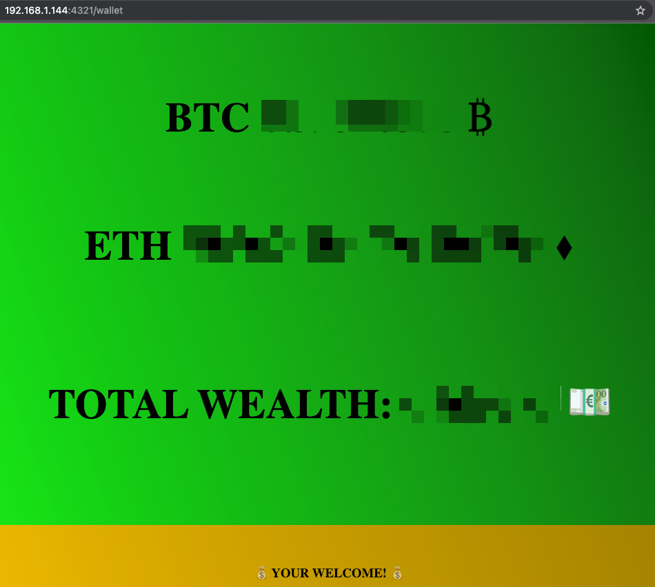

# 💎 PERSONAL CRYPTOCURRENCY BALANCE APP 💰

## Abstract

This repo contains a PoC for a web app through which you can check the real-time balance of your cryptocurrency assets.  
This PoC in particular focuses on *Bitcoin* (₿) and *Ethereum* (⟠).  
This can be a usefull app to have running 24/24 - 7/7 (for example) on a <a href="https://www.raspberrypi.org/">raspberrypi</a>  
and ready to to be consulted whenever you need it through a web browser.  


## Prerequisites
* At least one *Bitcoin* wallet with some balance in it
* At least one *Ethereum* wallet with some balance in it
* A <a href="https://coinmarketcap.com/">CoinMarketCap</a> API KEY (register for free)  

## Usage
Clone this repo:
```console
git clone https://github.com/R3DRUN3/crypto-balance-app.git && cd crypto-balance-app
```  
Edit the *app.py* file with your editor of choice and modify `BTC_ADDRESS_LIST`  
and `ETH_ADDRESS_LIST` to add your wallets addresses (you can put one or many as they are lists).  

Launch the app with docker compose:
```console 
docker-compose up
```   

Or launch the app with python:
```console
python3 app.py
```

Next go to `http://localhost:4321/wallet` and check your balance! 💰  


<div style="width: 65%; height: 65%">

  
  
</div>  
<br/>
Refresh the page whenever you want to see the updated balance.  

## To do next
* Threats the wallet addresses and the api key as secrets and inject them by following best practices
* Implement proper authentication to the web-app
* Expand on this template to build a production grade crypto balance app!


